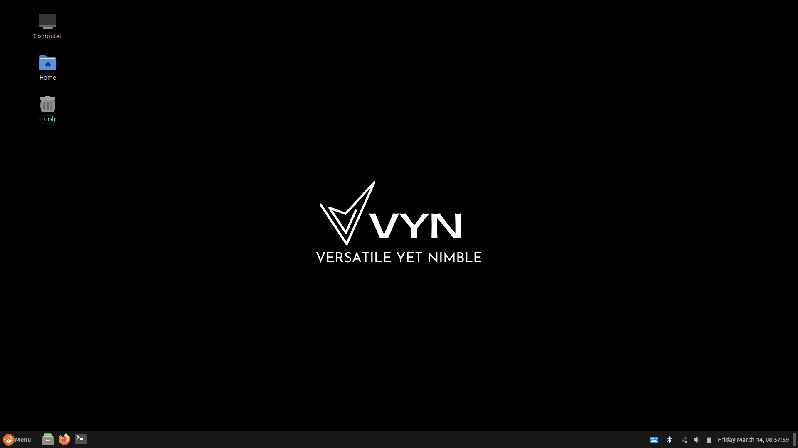
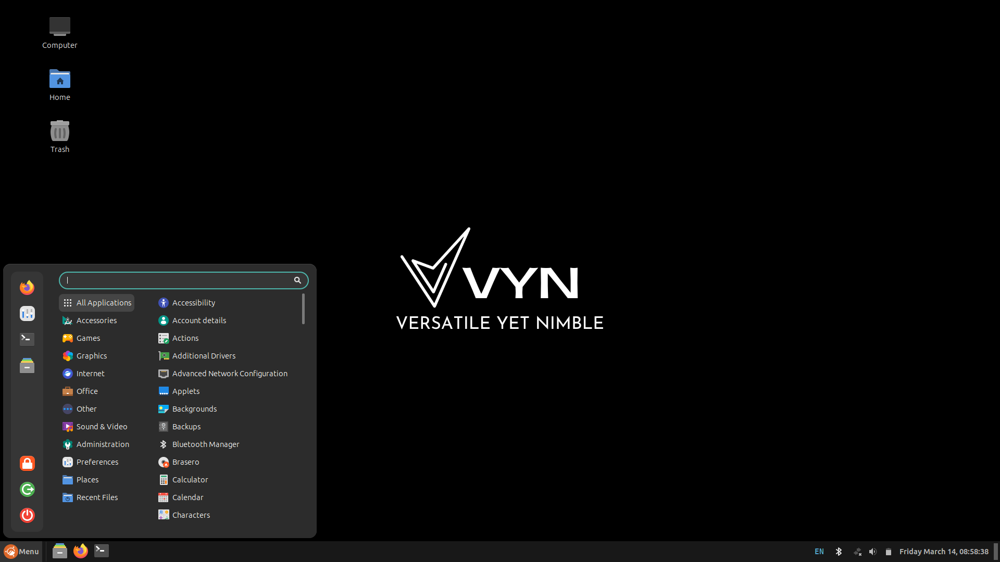
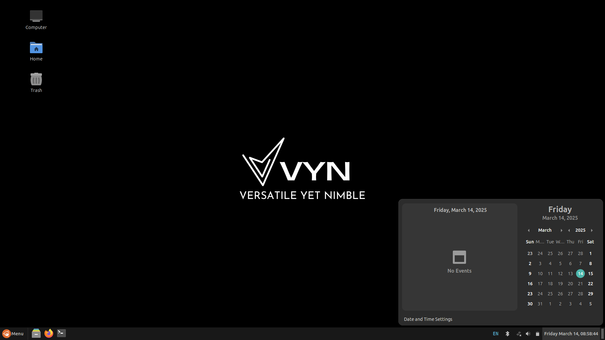
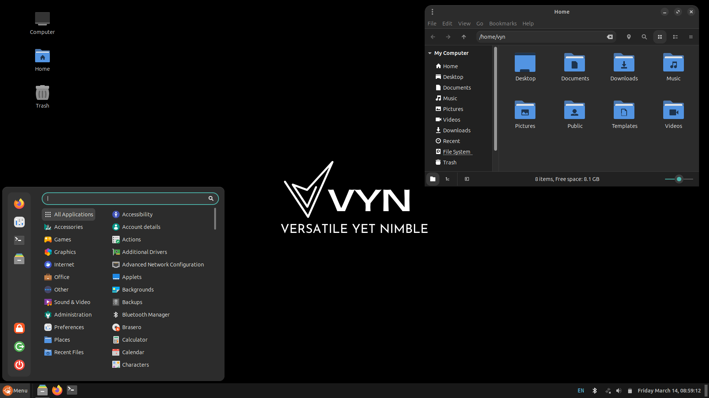
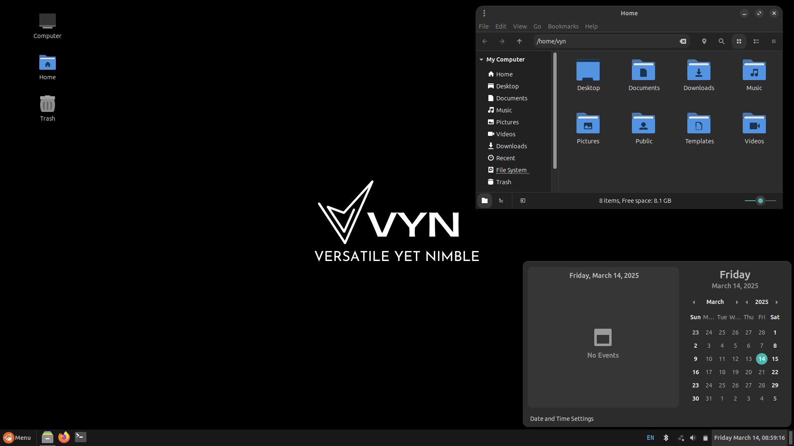
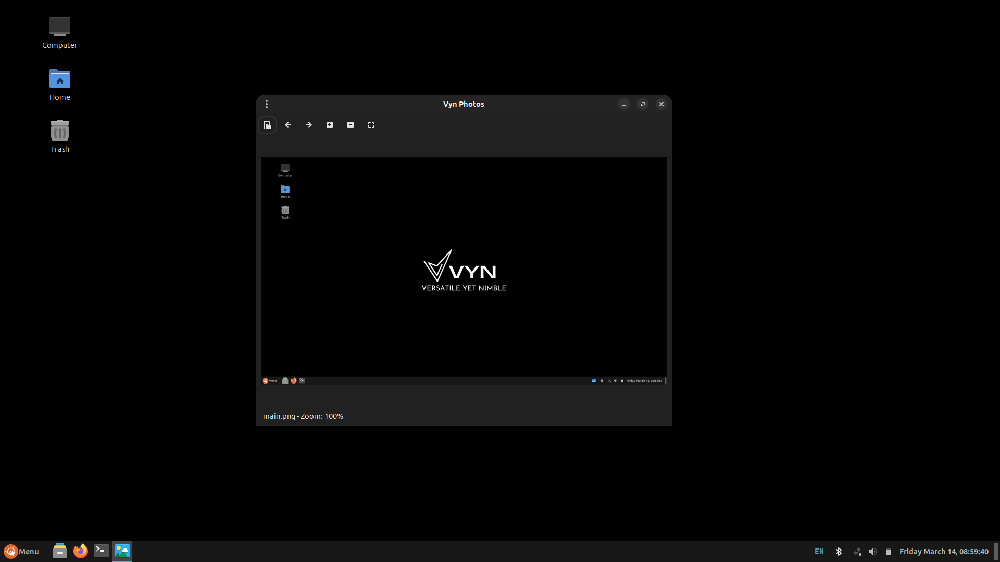
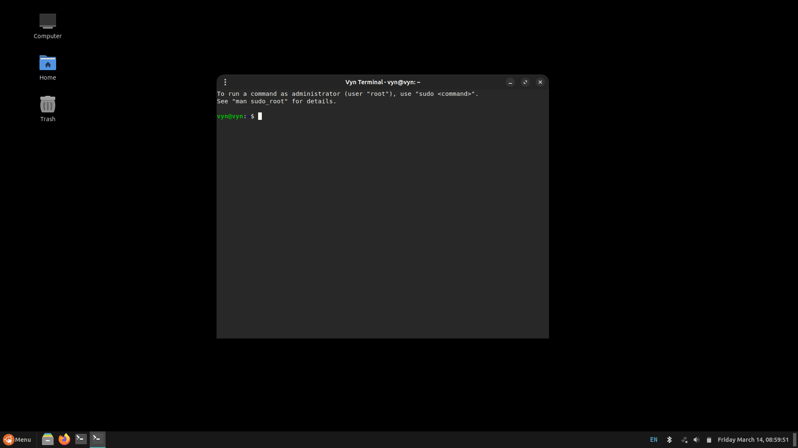
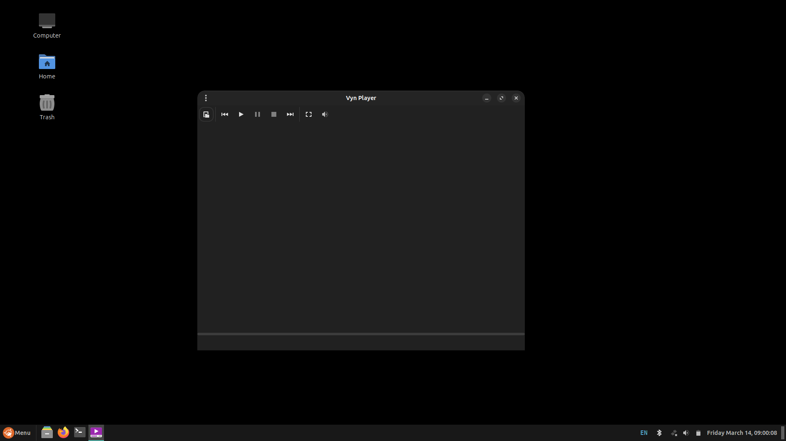

# VynOS

VynOS is a lightweight, Linux-based general-purpose operating system engineered for efficiency and speed. It is designed to bridge the gap between modern performance requirements and legacy systems, offering a streamlined, secure, and responsive computing experience.

## How VynOS Came Into Existence

VynOS was developed as part of our Final Year BTech Computer Science project.  
**Why build an operating system?**  
After years of using Linux, I wanted to experiment and create something unique. VynOS is based on Ubuntu and uses Cinnamon as its Desktop Environment, enhanced by a custom theme named "Vyn OS" built on the Fluent GTK theme. Cinnamon was chosen for its modern interface and its excellent performance on low-end hardware.

## Key Features

- **Custom Theme:**  
  A unique, custom-designed theme enhances the overall user experience and visual appeal.
  
- **Power Management Enhancements:**  
  Integration of TLP and Powertop optimizes power usage and improves battery life, making VynOS ideal for low-end systems.
  
- **Windows Compatibility:**  
  Wine support is built in to seamlessly run Windows applications.

- **Custom Applications:**  
  VynOS comes with a suite of preinstalled custom apps developed as part of our project, including:
  - **RoboDumb** and **TicTacWar:** Engaging games for casual entertainment.
  - **Vyn Player:** A dedicated media player.
  - **Vyn Photos:** A streamlined photo viewer.
  - **Vyn Terminal:** A customized terminal application for enhanced productivity.

## Screenshots

  
  
  
  
  
  
  
  

## Unique Selling Points

- **Optimized for Low-End Systems:**  
  Designed specifically for hardware with limited resources, ensuring smooth performance without compromise.
  
- **Modern User Interface:**  
  Enjoy a sleek, modern UI experience powered by Cinnamon and elevated by our custom Vyn OS theme.
  
- **Integrated Custom Tools:**  
  Benefit from a suite of custom applications that blend productivity and fun right out of the box.

## Aim

The primary goal of VynOS is to deliver a comfortable and efficient computing experience on low-end systems while providing a modern, visually appealing user interface.

## Roadmap & Future Directions

While VynOS is already a functional operating system, we have exciting plans ahead:
- **Feature Enhancements:**  
  Continual improvements to the custom theme and user interface.
- **Expanded Application Suite:**  
  Development of additional custom apps to further enhance user productivity and entertainment.
- **Performance Tweaks:**  
  Ongoing refinements to further optimize resource usage and overall system efficiency.
- **Community Contributions:**  
  We welcome feedback and contributions to help shape the future of VynOS.

## Acknowledgements

A heartfelt thank you to all my teammates and college faculty for their invaluable support throughout this project.

---

